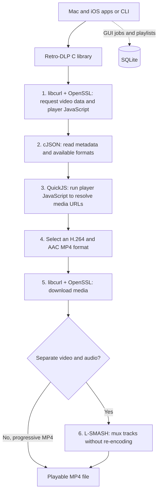

# Retro-DLP

Retro-DLP is a minimal re-implementation of yt-dlp written in C for retro Apple
devices. It's a C library plus a CLI for iOS 5+ and Mac OS X 10.4+. As well there
are simple GUI applications written for iOS 5+ and Mac OS X 10.4+.

Retro-DLP integrates several open source projects into 1 working solution:

- libcurl + OpenSSL: Modern networking with TLS 1.2 support
- QuickJS: Amazing C library that provides a working JavaScript runtime
- L-SMASH: Amazing C library that can mux audio and video files together into a single mp4
- SQLite: Provides a database for the GUI applications

## How it Works

Retro-DLP basically tries to do exactly what yt-delp does. It downloads
the Player Javascript, uses QuickJS to solve a challenge written in Javascript, 
downloads the audio and video files, then uses L-SMASH to mux them together into
a single H.264 file that your device can play back. 

The main thing that distinguishes it from yt-dlp is that it is written in C and
depends only on C libraries and thus can run on basically any device, no matter 
how old.

## Demo Videos

TBD

## Features

### Mac and iPhone Apps

- Download videos manually
- Add playlists manually
- Sync playlists from your account (read-only)
- Download videos at your specified quality level
- Download management
- Download queue
- Video Playback (VLC on Mac and custom player on iOS)
- Playlist Playback (VLC on Mac and custom player on iOS)
- Add cookies for authentication

### Command-Line Tool

Copies the yt-dlp command line arguments as best as possible given its limited
subset of features.

- Download videos at a specified quality
- Authenticate with a cookies file
- List a playlist
- List your playlists

### C Library

Core functionality written in a platform agnostic way. The library and the
CLI should be compatible and usable on any UNIX style OS on pretty much any
kind of hardware.

## Architecture



The apps use SQLite to keep track of playlists and downloads. The CLI and apps
share the same C library for resolving videos and downloading media. A
progressive MP4 already contains video and audio; separate tracks go through
L-SMASH before playback.

## Compatibility

Retro-DLP should work on any UNIX style OS on pretty much any hardware. But
the tested configurations and the binaries I distribute are compatible with
the following

- Mac OS X GUI: 10.4 Tiger - 10.14 Mojave - PowerPC and i386
- Mac OS X CLI: 10.4 Tiger - 10.14 Mojave - PowerPC and i386
- iOS GUI: iOS 5+ - armv7 and arm64 - Tested on iOS 6/8/15
   - Requires Jailbreak or install with [Impactor](https://github.com/claration/Impactor)
- iOS CLI: iOS 5+ - armv7 and arm64
   - Requires Jailbreak and a Terminal Application

## Video Formats

Retro-DLP downloads videos as MP4 files containing H.264 (AVC) video
and AAC audio. It supports both progressive MP4 files (video and audio already
combined) and separate video and audio tracks, which L-SMASH combines into one
MP4 without re-encoding.

| Media | Supported formats |
| --- | --- |
| Video | H.264 / AVC (`avc1`) in MP4 |
| Progressive audio | AAC-LC (`mp4a.40.2`) |
| Separate audio tracks | AAC-LC (`mp4a.40.2`) or HE-AAC (`mp4a.40.5`), mono or stereo |
| Output | MP4 containing both video and audio |


### Formats and Presets

Different videos have different video and audio formats available and they
are specified as numbers separated by a + sign. In the CLI to select a format 
manually use `-f`, to see available formats for a video use `-F`, and `-t` 
to use a preset below.

| Preset | Resolution | Format IDs |
| --- | --- | --- |
| `low` (Default) | 360p | `18` (combined video and audio) |
| `med` | 720p → 480p → 360p | `136+140/135+140/18` |
| `high` | 1080p → 720p → 480p → 360p | `137+140/136+140/135+140/18` |

Fallbacks apply when a format is unavailable during selection, not when
a media download fails (for example, with HTTP 403).

### Recommended Formats

It is important to remember that these videos are H.264 encoded which is a
very intense codec for retro computers. Read more about that in my blog post
[Retro Stream Tutorial.](https://jeffburg.com/retro-tech/2025/08/17/Retro-Stream-Tutorial.html#why-cant-old-computers-play-youtube)

- PPC Macs: 360p (18) 480p (135+140) are likely to play whereas 720p (136+140) ~~might~~ play
- Intel Macs: Untested, but 720p (136+140) and 1080p (137+140) will likely play
- Retina iOS Devices: 720p (136+140) can sometimes appear pixelated. 1080p (137+140) plays fine but take up a lot more disk space
- Non-Retina iOS Devices: Untested but 720p (136+140) will likely play and should look fantastic

## Known limitations:

- WebM, VP8, VP9, AV1, HEVC, and Opus are not supported. There is no
  transcoding, audio extraction, or audio-only download mode.
- Format selection accepts numeric IDs, `+` to pair video and audio, and `/`
  for alternatives, such as `137+140/136+140/18`. General yt-dlp selectors
  such as `bestvideo`, codec filters, and sorting expressions are not supported.
- The library's automatic adaptive selection is limited to 720p or 1080p,
  at up to 30 fps, with AAC-LC audio. Explicit format IDs can select HE-AAC
  and do not impose those resolution or frame-rate limits, but the codecs
  must still be supported and the requested tracks must be available.
- The original audio track is always selected for downloaded. Other languages
  are not selectable.
- Retro-DLP uses `mweb` client and does not generate Proof of
  Origin (PO) tokens.
  
### PO Tokens

PO Tokens are a tricky subject even for the original yt-dlp. Basically, 
Retro-DLP has sufficient JavaScript chops via QuickJS that it can solve the 
simple JavaScript Player Challenge and find the URL's for the videos. However,
if you select a video format higher quality than 360p (18), your download will 
likely fail because of lack of a PO token. Stick to 360p OR you can 
authenticate with an account that is a Premium account. But before you do that,
please read the as its and the Cookies Extraction Guide not a simple problem 
and there are risks.

- [PO Token Guide](https://github.com/yt-dlp/yt-dlp/wiki/Po-Token-Guide)
- [Cookies Extraction Guide](https://github.com/yt-dlp/yt-dlp/wiki/Extractors#exporting-youtube-cookies)

## Download

[Download Retro-DLP from GitHub Releases](https://github.com/jeffreybergier/Retro-DLP/releases).
Each release includes these files (`{version}` is the release number):

- `Retro-DLP-{version}-macOS-gui.zip` — the Mac app (`RetroDLP.app`).
- `Retro-DLP-{version}-iOS-gui.ipa` — the iPhone and iPad app for jailbroken devices.
- `Retro-DLP-{version}-macOS-cli.zip` — the Mac command-line tool and its
  `cacert.pem` certificate bundle; keep both files together.
- `Retro-DLP-{version}-iOS-cli.zip` — the iOS command-line tool and its
  `cacert.pem` certificate bundle for a jailbroken device's terminal.
- `Retro-DLP-{version}-macOS-library.zip` — Mac static C libraries, public
  headers, examples, and license for developers.
- `Retro-DLP-{version}-iOS-library.zip` — iOS static C libraries, public
  headers, examples, and license for developers.
- `Source code (zip)` and `Source code (tar.gz)` — GitHub-generated source
  archives for building from source.


### iOS

### Mac

### Command-Line Tool

## Using Retro-DLP CLI

Run `retro-dlp [OPTIONS] VIDEO_ID_OR_URL` to work with a video or playlist.

| Short | Long | Description |
| --- | --- | --- |
| `-h` | `--help` | Show usage. |
| `-V` | `--version` | Show version and build platform. |
| `-f FORMAT` | `--format FORMAT` | Select exact format IDs or fallback choices. |
| `-t PRESET` | `--preset-alias PRESET` | Use the `low`, `med`, or `high` preset. |
| `-F` | `--list-formats` | List available formats. |
| — | `--flat-playlist` | List playlist entries without downloading. |
| `-o FILE` | `--output FILE` | Save the MP4 to `FILE`. |
| `-s` | `--simulate` | Resolve without downloading. |
| `-j` | `--dump-json` | Print JSON without downloading. |
| — | `--cookies FILE` | Read Netscape-format cookies from `FILE`. |
| — | `--cookies-default` | Read `~/.retro-dlp/cookies.txt`. |

`VIDEO_ID_OR_URL` is the video ID, video URL, or playlist URL to process.
Use `retro-dlp assets status`, `assets install`, or `assets remove` to inspect,
install, or remove the pinned EJS assets.


## Compile from Source

Retro-DLP uses the Altivec Intelligence container for Apple builds. It requires
Apple SDKs that are not provided with this repository or the container; see
[Altivec Intelligence's BYOSDK instructions](https://github.com/jeffreybergier/AltivecIntelligence#byosdk)
to supply them before building.

Clone the repository with its submodules, then run these commands from the
repository root after preparing the SDK archives:

```sh
git clone --recurse-submodules https://github.com/jeffreybergier/Retro-DLP.git
cd Retro-DLP
docker compose pull
docker compose run --rm altivec-sdk install
docker compose run --rm altivec "make clean app-clean"
docker compose run --rm altivec "make release apps"
```

`release` builds the macOS and iOS command-line tools and libraries; `apps`
builds both GUIs. The outputs are:

- macOS CLI: `build/macOS/ppc-i386/retro-dlp` and `build/macOS/cacert.pem`
- iOS CLI: `build/iOS/retro-dlp` and `build/iOS/cacert.pem`
- Mac app: `build/apps/macOS/RetroDLP.zip`
- iOS app: `build/apps/iOS/RetroDLP.ipa`

Keep each CLI binary with its `cacert.pem` when copying it to a device.

### Running Tests

Run the offline Linux CLI and C library tests, including public API examples,
plus the portable GUI store and service tests:

```sh
docker compose run --rm altivec "make test app-test"
```

After an Apple build, check the app packages and cross-compiled binaries:

```sh
docker compose run --rm altivec "make app-validate validate-apple-artifacts"
```

For an offline iOS UI regression test, build its separate test app after the
iOS GUI build:

```sh
docker compose run --rm altivec "python3 source/gui/iOS/tests/build_ios_ui_test.py"
```

Install `build/apps/tests/RetroDLPIOSOfflineTest.ipa` on a jailbroken test
device and open it. The result is written to the app's `Documents/result.txt`.

For a real-device smoke test of Retro-DLP itself, copy the Mac app or CLI to a
supported Mac, or install the IPA or CLI on a jailbroken iOS device. Launch
the app, resolve a video or playlist, download an MP4, and play it. For the
CLI, run `retro-dlp --version`, then `retro-dlp --simulate VIDEO_URL` and a
short download using a real video URL. These checks exercise device networking
and playback, which the Linux tests and cross-build validation cannot verify.

## Source Map

## Contributing

### Wish List

## Credits

## Status and License
